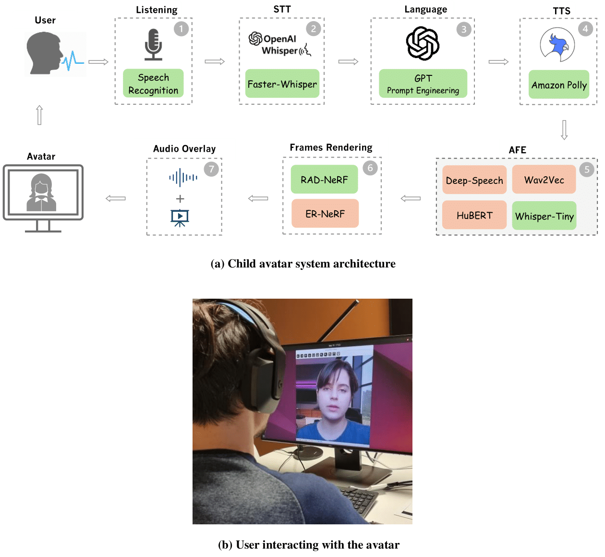

# Comparative Analysis of Audio Feature Extraction for Real-Time Talking Portrait Synthesis

[](https://www.mdpi.com/2504-2289/9/3/59)
[](https://arxiv.org/abs/2411.13209)




(a) System architecture of the interactive child avatar, detailing the integration of key modules: (1) Listening,
(2) STT, (3) Language Processing, (4) TTS, (5) AFE, (6) Frames Rendering, and (7) Audio Overlay. This setup
simulates natural conversation, allowing the user to interact with the avatar as if communicating with a real person. (b)
User interaction with the child avatar system.

## Result based on RAD-NeRF

[](https://youtu.be/sBZWHk8y8-U)

## Result based on ER-NeRF

[](https://youtu.be/BqKS1KAfrhA)


## Audio Feature Extraction (AFE)

You should specify the type of audio feature when training and testing framework like: [ER-Nerf](https://github.com/Fictionarry/ER-NeRF) and [RAD-NeRF](https://github.com/ashawkey/RAD-NeRF)


### DeepSpeech

To extract features with DeepSpeech, use the following command:

```bash
python AFEs/deepspeech_features/extract_ds_features.py --input data/<name>.wav # save to data/
```

### HuBERT
To extract features with HuBERT, use the following command:
```bash

python AFEs/hubert.py --wav data/<name>.wav # save to data/<name>_hu.npy
```

### Wav2Vec
To extract features with Wav2Vec, use the following command:

```bash
python AFEs/wav2vec.py --wav data/<name>.wav --save_feats # save to data/<name>_eo.npy
```
### Whisper

To extract features with Whisper, use the following command:

```bash
python AFEs/whisper.py 
```
### Citation
---
Please cite this paper in your publications if it helps your research:
```
@article{salehi2025comparative,
  title={Comparative analysis of audio feature extraction for real-time talking portrait synthesis},
  author={Salehi, Pegah and Sheshkal, Sajad Amouei and Thambawita, Vajira and Gautam, Sushant and Sabet, Saeed S and Johansen, Dag and Riegler, Michael A and Halvorsen, P{\aa}l},
  journal={Big Data and Cognitive Computing},
  volume={9},
  number={3},
  pages={59},
  year={2025},
  publisher={MDPI}
}
```


